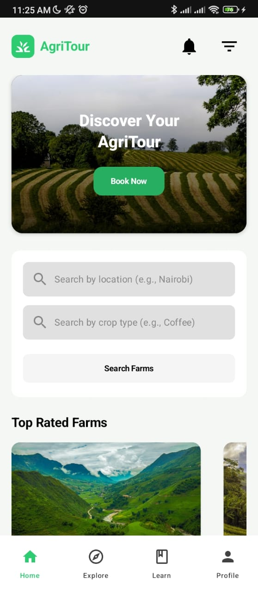
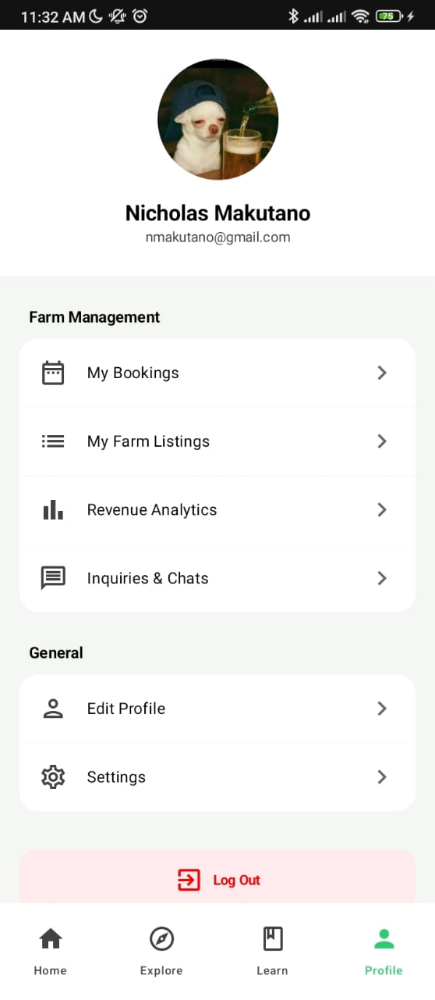
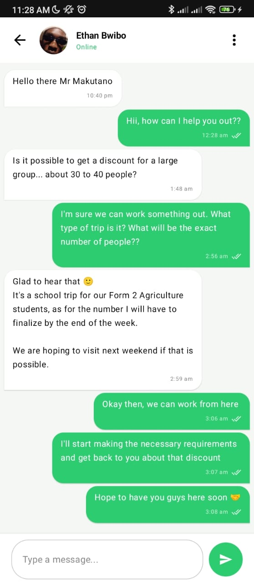
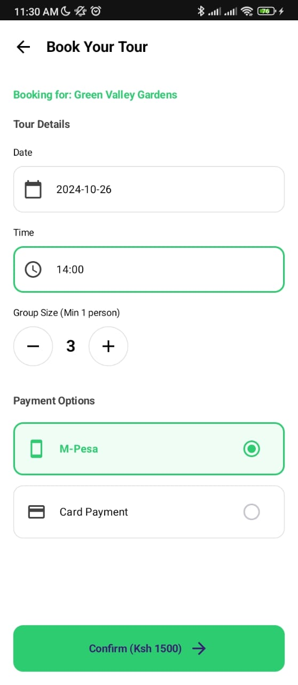

# AgriTour 🌿
**Bridging the gap between theoretical agriculture studies and practical field experience.**

AgriTour is a native Android application that connects students and agri-enthusiasts with local farmers for immersive, hands-on learning tours. It serves as a marketplace for agricultural knowledge, allowing users to book tours, communicate with farmers, and explore various agricultural practices.

## 🚀 Technical Highlights & Problem Solving
This project showcases advanced Android development patterns, specifically addressing real-world performance constraints:

**Efficient Data Pipeline**: Implemented a custom image compression utility using Bitmap.compress that reduces 5MB+ high-resolution camera photos to ~300KB before uploading to Firebase Storage.

**Real-Time Architecture**: Utilizes Firebase Realtime Database for instant messaging and Firestore for structured data like User Profiles and Farm Listings.

**Smooth UX Patterns**: Integrated a "Shimmer Effect" (skeleton screens) using Jetpack Compose animations to provide visual feedback during asynchronous data fetching.

**Security & Privacy**: Built a secure authentication flow including confirmation dialogs for destructive actions like Account Deletion and Logging Out.

## ✨ Key Features
**Explore Farms**: Browse diverse farm listings with detailed descriptions, pricing, and ratings.

**Instant Booking**: Interactive booking system with group size management and payment method selection (M-Pesa/Card).

**Live Chat**: Direct communication channel between visitors and farm owners with real-time message bubbles and read status.

**Farmer Dashboard**: Dedicated interface for farmers to manage their listings and view incoming tour requests.

## 🛠 Tech Stack
**UI**: Jetpack Compose (Material 3) with custom themeing.

**Backend**: Firebase Authentication, Cloud Firestore, Realtime Database, and Firebase Storage.

**Asynchronous Programming**: Kotlin Coroutines & StateFlow for reactive UI updates.

**Image Loading**: Coil for optimized image caching and rendering.

## 📸 Screenshots

|                      Splash Screen                       |                     Home & Explore                     |                       User Profile                        |                     Real-time Chat                     |                      Booking Process                      |
|:--------------------------------------------------------:|:------------------------------------------------------:|:---------------------------------------------------------:|:------------------------------------------------------:|:---------------------------------------------------------:|
|  |  |  |  |  |

## 🚀 Future Scope & Roadmap
While the current version of AgriTour provides a solid foundation for agri-education, the following features are planned for future releases:

**Integrated M-Pesa API (Daraja)**: Moving beyond manual selection to automated in-app payment processing, providing instant transaction confirmation for both farmers and visitors.

**Booking History & Management**: A dedicated dashboard for users to track upcoming and past tours, and for farmers to manage their revenue analytics.

**AI-Powered Crop Identification**: Integrating machine learning models to help students identify crops and diseases via the camera during their field tours.

**Offline Mode**: Leveraging Room Database for local caching, allowing users to view farm details and maps in remote areas with poor connectivity.